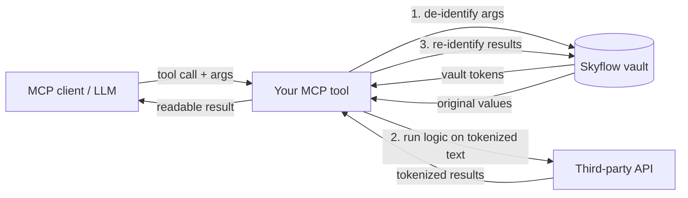

# Wrapping Your MCP Tools with Skyflow — De-identify / Re-identify Guide

This is a guide for developers who run their **own remote HTTP MCP server** and want to keep
sensitive data (PII/PHI) out of the third-party services, logs, and models their tools touch —
without rebuilding their tools around Skyflow. The idea is simple: **de-identify sensitive values
on the way *in* (the request), do your work on tokenized text, then re-identify on the way *out*
(the response)** using reversible Skyflow **vault tokens**. The original values never leave your
server in the clear, and the trusted caller still gets a fully readable result.

This repo (`skyflow-runtime-mcp`) already exposes `de-identify` and `re-identify` as standalone
MCP tools. This guide shows how to fold the *same* Skyflow calls directly into your own server's
existing tools instead. The live reference implementation is in
`src/lib/tools/deIdentify.ts` and `src/lib/tools/reIdentify.ts`.

> [!NOTE]
> The examples use the [`skyflow-node`](https://www.npmjs.com/package/skyflow-node) SDK (the same
> version this repo depends on, `^2.0.0`). A raw REST alternative for non-Node stacks is covered in
> [Approach B](#approach-b--detect-rest-api-any-language).

## The pattern

A wrapped tool call is a three-step round-trip around your existing logic:

1. **De-identify the request.** Before your tool does anything with the input, replace sensitive
   values with vault tokens (`[EMAIL_ADDRESS_a1b2]`, `[NAME_c3d4]`, …).
2. **Run your logic on the tokenized text.** Any third-party API, log line, or prompt now only
   ever sees tokens, never the real values.
3. **Re-identify the response.** Swap the tokens back to the original values right before you
   return the result to the trusted caller.



> **Note:** De-identifying the request deliberately changes what the downstream service sees — that
> is the whole point. The third party (search provider, LLM, analytics, storage) receives tokens
> instead of PII, while your caller still gets the real values back after step 3.

The inverse arrangement is also common: **de-identify a tool's *output*** (e.g. records you fetched
from your own database) so the model and your logs only ever see tokens, and re-identify later only
for the authorized human. Both directions use the exact same two SDK calls below.

## How vault tokens work

Re-identification is only possible because de-identify mints **reversible** tokens that are
persisted in your vault. Choosing the wrong token type is the most common mistake.

| Token type | What it looks like | Persisted? | Reversible? | When to use |
|------------|--------------------|------------|-------------|-------------|
| `VAULT_TOKEN` | `[EMAIL_ADDRESS_a1b2c3]` | Yes, in your vault | **Yes** | The wrapping pattern in this guide — you need to re-identify later. |
| `ENTITY_UNIQUE_COUNTER` | `[EMAIL_ADDRESS_1]` | No | No | One-way redaction / demos only. Cannot be re-identified. |

> [!WARNING]
> Re-identify only works for `VAULT_TOKEN` tokens minted by the **same authenticated vault**.
> Tokens produced without authenticated credentials (this repo's "anonymous mode", which uses
> `ENTITY_UNIQUE_COUNTER`) are **not** reversible. The wrapping pattern therefore requires real
> vault credentials.

## Prerequisites

You need a Skyflow vault and its connection details. All of these come from the Skyflow dashboard.

| Value | Example | Notes |
|-------|---------|-------|
| Vault ID | `9a8b7c6d5e4f0011` | The vault identifier — a separate value from the cluster ID. |
| Vault URL | `https://ebfc9bee4242.vault.skyflowapis.com` | The **cluster ID** is the first DNS label (`ebfc9bee4242`), derived from this URL. |
| Credential | API key **or** bearer token (JWT) | See [Credentials & configuration](#credentials--configuration). |

Derive the cluster ID from the vault URL exactly the way this repo does
(`src/lib/validation/vaultConfig.ts`):

```ts
const clusterId = vaultUrl.match(/(?:https?:\/\/)?([^.]+)\.vault/)?.[1];
// "https://ebfc9bee4242.vault.skyflowapis.com" -> "ebfc9bee4242"
```

## Approach A — `skyflow-node` SDK (recommended)

### 1. Install and construct one client

```bash
npm install skyflow-node
```

```ts
import { Skyflow } from "skyflow-node";

const vaultUrl = process.env.SKYFLOW_VAULT_URL; // e.g. https://ebfc9bee4242.vault.skyflowapis.com
const clusterId = vaultUrl?.match(/(?:https?:\/\/)?([^.]+)\.vault/)?.[1];
if (!clusterId) {
  throw new Error(`Invalid or missing SKYFLOW_VAULT_URL: ${vaultUrl}`);
}

const skyflow = new Skyflow({
  vaultConfigs: [
    {
      vaultId: process.env.SKYFLOW_VAULT_ID!,
      clusterId,
      // Use an API key ({ apiKey }) OR a bearer token ({ token: "<jwt>" }).
      credentials: { apiKey: process.env.SKYFLOW_API_KEY! },
    },
  ],
});
```

The guard fails loudly on a missing or malformed vault URL instead of silently passing `undefined`
as the cluster ID — the same thing this repo does in `extractClusterId` / `validateVaultConfig`
(`src/lib/validation/vaultConfig.ts`). Give the other required env vars (`SKYFLOW_VAULT_ID`,
`SKYFLOW_API_KEY`) the same fail-loudly treatment in production; the `!` assertions above are just
to keep the snippet short.

### 2. Two small helpers

These mirror the calls in `src/lib/tools/deIdentify.ts` and `src/lib/tools/reIdentify.ts`.

```ts
import {
  DeidentifyTextRequest,
  DeidentifyTextOptions,
  TokenFormat,
  TokenType,
  ReidentifyTextRequest,
} from "skyflow-node";

// De-identify: replace sensitive values with reversible vault tokens.
async function deidentify(text: string): Promise<string> {
  const tokenFormat = new TokenFormat();
  tokenFormat.setDefault(TokenType.VAULT_TOKEN); // reversible + persisted

  const options = new DeidentifyTextOptions();
  options.setTokenFormat(tokenFormat);

  const res = await skyflow
    .detect()
    .deidentifyText(new DeidentifyTextRequest(text), options);

  return res.processedText; // e.g. "email [EMAIL_ADDRESS_a1b2] about order 12345"
}

// Re-identify: swap the vault tokens back to the original values.
async function reidentify(text: string): Promise<string> {
  const res = await skyflow
    .detect()
    .reidentifyText(new ReidentifyTextRequest(text));

  return res.processedText; // original values restored
}
```

The tokens are embedded **inline** in `processedText`, so you can pass a whole string (or a
serialized JSON blob) straight to `reidentify` — there is no separate token list to thread through.
If you also want the structured breakdown of what was detected, `deidentifyText` returns
`res.entities[]`, where each entry has `{ token, value, entity, textIndex, processedIndex, scores }`.

> **Note:** These helpers omit error handling for brevity. In production, wrap the Detect
> calls and handle `SkyflowError` (invalid credentials, expired token, vault errors) the way
> the repo handlers do — catching it and surfacing `http_code` / `details`
> (`src/lib/tools/deIdentify.ts`).

### 3. Wrap a tool call

Here is a generic MCP tool (using the official MCP SDK's `registerTool`) that forwards text to a
third-party service — say a summarizer or an LLM — and returns text derived from it. The only
additions are the `deidentify` on the way in and `reidentify` on the way out:

```ts
server.registerTool(
  "summarize",
  { title: "Summarize", description: "...", inputSchema: { text: z.string() } },
  async ({ text }) => {
    // 1. De-identify the request — the third-party service only ever sees tokens.
    const safeText = await deidentify(text);

    // 2. Run your existing logic on the tokenized text. The tokens flow through
    //    into the summary the service returns.
    const summary = await callThirdPartyLlm(safeText);

    // 3. Re-identify the response — restore real values for the trusted caller.
    const restored = await reidentify(summary);

    return { content: [{ type: "text", text: restored }] };
  }
);
```

That is the whole integration: two helper calls bracketing logic you already have.

> **Note:** Re-identify matches token strings **verbatim** — it only restores tokens that come back
> in the response exactly as they left (`[EMAIL_ADDRESS_a1b2]`). Two things to keep in mind:
> - A model that paraphrases, reformats, or truncates text (a summarizer/LLM) can alter or drop a
>   bracketed token, in which case it silently won't be re-identified. Test that your downstream
>   call preserves tokens intact before relying on the round-trip.
> - A tool like **search** returns matched documents rather than an echo of your query, so
>   re-identifying the results is often a no-op.
>
> Either way, the guaranteed win is on the **request** side — PII never reaches the third party —
> and re-identify restores whatever tokens survive intact.

### Optional: limit detection to specific entities

By default Skyflow detects every supported entity type. To scope detection (faster, fewer false
positives), pass a `DetectEntities` list to the de-identify options:

```ts
import { DetectEntities } from "skyflow-node";

options.setEntities([DetectEntities.EMAIL_ADDRESS, DetectEntities.SSN, DetectEntities.NAME]);
```

The full set of supported entities is the `DetectEntities` enum in `skyflow-node`. This repo keeps a
lowercase string → enum map in `src/lib/mappings/entityMaps.ts` (`ENTITY_MAP`) — handy as a
reference list. Common values include `email_address`, `ssn`, `credit_card`, `name`,
`phone_number`, `ip_address`, `location`, and `bank_account`.

### Optional: control re-identify output format

Re-identify fully restores every token by default. To render specific entity types differently on
the way out — reveal some, partially mask others, fully redact the rest — pass a
`ReidentifyTextOptions` as the second argument. Entity types you don't list fall back to the Detect
API's default and are restored as full plaintext:

```ts
import { ReidentifyTextOptions, DetectEntities } from "skyflow-node";

const options = new ReidentifyTextOptions();
options.setPlainTextEntities([DetectEntities.NAME]);      // restore in full
options.setMaskedEntities([DetectEntities.SSN]);          // partially masked; exact form depends on vault config
options.setRedactedEntities([DetectEntities.EMAIL_ADDRESS]); // fully hidden

const res = await skyflow
  .detect()
  .reidentifyText(new ReidentifyTextRequest(text), options);
```

This is the same capability the `re-identify` MCP tool exposes via its optional `format` argument
(`{ redacted, masked, plaintext }`); see `src/lib/tools/reIdentify.ts`.

## Approach B — Detect REST API (any language)

The SDK just wraps Skyflow's **Detect REST API**, so any language can run the same round-trip over
plain HTTP. Each call is a single `POST` to your vault's cluster host
(`https://<CLUSTER_ID>.vault.skyflowapis.com`) with an `Authorization: Bearer <token>` header — no
other custom headers are required.

**De-identify** — `POST /v1/detect/deidentify/string`:

```bash
curl -X POST "https://$CLUSTER_ID.vault.skyflowapis.com/v1/detect/deidentify/string" \
  -H "Authorization: Bearer $TOKEN" \
  -H "Content-Type: application/json" \
  -d '{
    "vault_id": "'"$VAULT_ID"'",
    "text": "email john.doe@example.com about order 12345",
    "token_type": { "default": "vault_token" }
  }'
```

```json
{
  "processed_text": "email [EMAIL_ADDRESS_a1b2] about order 12345",
  "entities": [
    {
      "token": "[EMAIL_ADDRESS_a1b2]",
      "value": "john.doe@example.com",
      "entity_type": "email_address",
      "entity_scores": { "email_address": 0.99 },
      "location": { "start": 6, "end": 26 }
    }
  ],
  "word_count": 5,
  "character_count": 44
}
```

`text` and `vault_id` are required. `token_type.default` picks the token type — `vault_token` for the
reversible round-trip, or `entity_unq_counter` / `entity_only` for one-way redaction. Add an optional
`entity_types` array to scope detection; its values are the same lowercase names as the SDK's
`ENTITY_MAP` keys (`email_address`, `ssn`, `name`, …, or `all`). Omit it to detect everything.

**Re-identify** — `POST /v1/detect/reidentify/string`. Send the tokenized text back with the same
vault and it resolves the tokens:

```bash
curl -X POST "https://$CLUSTER_ID.vault.skyflowapis.com/v1/detect/reidentify/string" \
  -H "Authorization: Bearer $TOKEN" \
  -H "Content-Type: application/json" \
  -d '{
    "vault_id": "'"$VAULT_ID"'",
    "text": "email [EMAIL_ADDRESS_a1b2] about order 12345"
  }'
```

```json
{ "text": "email john.doe@example.com about order 12345" }
```

`text` and `vault_id` are required. Add an optional `format` object to control how each entity type
is rendered — `{ "redacted": [...], "masked": [...], "plaintext": [...] }`, each a list of the same
lowercase entity names. Entity types you don't list fall back to the Detect API's default and are restored as full plaintext:

```json
{
  "vault_id": "...",
  "text": "email [EMAIL_ADDRESS_a1b2], ssn [SSN_c3d4]",
  "format": { "redacted": ["email_address"], "masked": ["ssn"] }
}
```

Note the re-identify response field is `text`, while de-identify returns `processed_text` — an
asymmetry in the raw v1 wire format. The `skyflow-node` SDK (Approach A) smooths this over: it
surfaces both as `processedText`, and exposes each detected entity with `entity` / `scores` /
`textIndex` / `processedIndex` fields rather than the wire's `entity_type` / `entity_scores` /
`location`.

> [!NOTE]
> These are the generally-available **v1** endpoints. Skyflow also has a **v2** Detect API (in beta,
> feature-flagged) that uses `camelCase` fields and a reusable Detect *configuration* instead of
> per-request options — see the [Detect API reference](https://docs.skyflow.com/detect/). `$TOKEN`
> is a Skyflow bearer token (an API key also works); generate a bearer token from service-account
> credentials via the Management API OAuth exchange (`POST /v1/auth/sa/oauth/token`). With a Node
> runtime, prefer [Approach A](#approach-a--skyflow-node-sdk-recommended) — it handles auth and
> token refresh for you.

## Credentials & configuration

Skyflow accepts two credential formats, and this repo's middleware
(`src/lib/middleware/authenticateBearer.ts`) shows how to tell them apart:

- **Bearer token (JWT)** — a value with three dot-separated base64url parts. Pass it to the SDK as
  `credentials: { token: "<jwt>" }`.
- **API key** — anything that is *not* JWT-shaped. Pass it as `credentials: { apiKey: "<key>" }`.

A minimal set of environment variables for your own server:

```bash
SKYFLOW_VAULT_ID=9a8b7c6d5e4f0011                            # distinct from the cluster ID below
SKYFLOW_VAULT_URL=https://ebfc9bee4242.vault.skyflowapis.com  # cluster ID derived from this
SKYFLOW_API_KEY=<your-api-key>                                # or a bearer token
```

## Gotchas

- **Re-identify needs authenticated vault credentials.** `ENTITY_UNIQUE_COUNTER` / anonymous tokens
  are one-way and cannot be restored.
- **Tokens live inline in `processedText`.** Pass the whole string to `reidentify`; you do not need
  to extract or store a separate token list between the two calls.
- **Entity selection is optional.** Omit it to detect everything, or scope it with `setEntities`.
- **Keep the round-trip stateless per call.** De-identify, run, and re-identify within the same tool
  invocation, and don't hold tokens in local server memory. You don't need to: with `VAULT_TOKEN`,
  the token↔value mapping lives in the vault, so re-identify still resolves the original values in a
  later call or a separate process.
- **Same vault both ways.** Re-identify against the vault that minted the tokens.

## Reference & next steps

- **Working example in this repo:** `src/lib/tools/deIdentify.ts`, `src/lib/tools/reIdentify.ts`,
  and the per-request client setup in `src/server.ts`.
- **SDK:** [`skyflow-node`](https://www.npmjs.com/package/skyflow-node).
- **REST:** [Skyflow Detect API reference](https://docs.skyflow.com/detect/).

Deferred to a later revision of this guide: choosing *where* to wrap (per-tool handler vs. a central
request chokepoint vs. a reusable `withSkyflow()` higher-order wrapper), error handling, and the
latency/cost trade-offs of the extra Detect calls.
